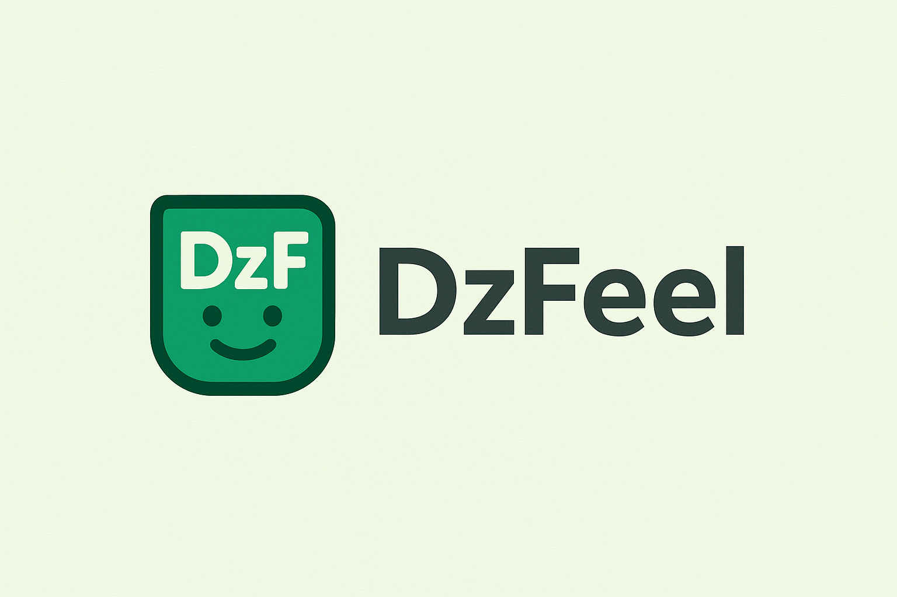

# DzFeel 🧠🇩🇿

**تحليل المشاعر باللهجة الجزائرية – بسيط، سريع، وقابل للتطوير.**

 <!-- ضع هنا رابط/مسار الشعار إن وُجد -->

---

## 📌 نظرة عامة

**DzFeel** هي مكتبة Python لتحليل المشاعر (الآراء) المكتوبة باللهجة الجزائرية. تعتمد المكتبة على قواعد بسيطة وقاموس لغوي لتحويل الكلام الشعبي إلى صيغة فصحى قابلة للتحليل، ثم تستخدم قواعد للتعرف على النبرة (إيجابية، سلبية، محايدة).

---

## 🚀 ميزات المكتبة

- ⚡ **معالجة سريعة**: لا تعتمد على نماذج ضخمة.
- 🧹 **تنظيف وتحويل اللهجة**: استبدال التعابير العامية بكلمات فصحى.
- 📊 **تحليل قائم على القواعد** (Rule-based).
- 🧪 **بيانات اختبار مدمجة** لتجريب أداء المكتبة بسهولة.
- 🧩 **تصميم بسيط قابل للتوسعة مستقبلاً**.

---

## 🔧 التثبيت

```bash
# قريباً على PyPI:
pip install dzfeel
